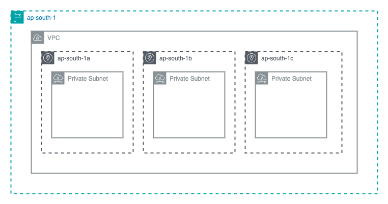
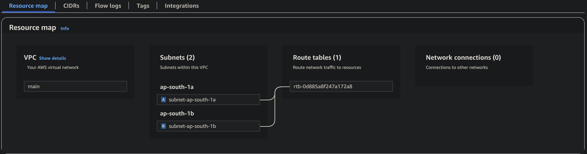

# 01-vpc-subnet

> **📊 Lab Info**  
> **Difficulty:** 🟢 Beginner
> **Estimated Time:** 15-20 minutes
> **AWS Services:** VPC, Subnets
> **Prerequisites:** AWS CLI configured, Terraform basics

## Overview

This lab creates a foundation VPC with multiple subnets distributed across availability zones.

## Architecture



- **VPC**: Custom CIDR block with DNS resolution enabled
- **Subnets**: One per AZ, automatically calculated with non-overlapping CIDRs
- **Distribution**: Subnets spread across AZs for high availability

> **Note**: These are private subnets by default. Internet access will be configured in the next lab.

## You’ll Learn

- How to define a custom VPC with essential networking options
- How to use **Terraform data sources** to fetch AWS availability zones dynamically
- How to dynamically create subnets across Availability Zones
- How to use Terraform's `cidrsubnet()` to calculate non-overlapping CIDRs for subnets within VPC
- How to use `for_each` loops with local values for dynamic resource creation
- Best practices for tagging AWS resources

## Resources You'll Create

- 1 VPC with a custom CIDR block
- Multiple subnets distributed across Availability Zones (quantity controlled by num_subnets variable)

## Key Concepts Explained

### What is a VPC?

- Virtual Private Cloud: Your own isolated network within AWS
- Think of it as your private data center in the cloud
- All resources (EC2, RDS, etc.) live inside VPCs

### CIDR Blocks and IP Addressing

- CIDR notation (e.g., `10.0.0.0/16`) defines your network's IP range
- `/16` means 65,536 available IP addresses (10.0.0.0 to 10.0.255.255)
- Subnets carve smaller blocks from the VPC CIDR

### Availability Zones (AZs)

- Physically separate data centers within a region
- Distributing subnets across AZs provides high availability
- If one AZ fails, resources in other AZs remain available

### Subnets

- Subnets divide your VPC into smaller networks
- Each subnet exists in exactly one AZ
- Resources are launched into specific subnets

### The `cidrsubnet()` Function

- `cidrsubnet("10.0.0.0/16", 8, 0)` creates `10.0.0.0/24`
- `cidrsubnet("10.0.0.0/16", 8, 1)` creates `10.0.1.0/24`
- Automatically calculates non-overlapping subnet ranges

### DNS in VPC

- `enable_dns_support`: Allows DNS resolution within the VPC
- `enable_dns_hostnames`: EC2 instances get DNS names (needed for public access later)

## Example Usage

Create a `terraform.tfvars` file:

```hcl
vpc_cidr = "10.0.0.0/16"
vpc_name = "my-lab-vpc"
num_subnets = 3
tags = {
  Environment = "lab"
  Project     = "aws-networking"
}
```

## Deployment

```bash
cd 01-vpc-subnet
terraform init
terraform plan
terraform apply
```

## What Gets Created

After running `terraform apply`, you'll see outputs similar to:

```text
Outputs:

subnet_cidrs = [
  "10.0.0.0/24",
  "10.0.1.0/24",
]
subnet_ids = [
  "subnet-053a48402cf1c8186",
  "subnet-0534fc90b7ad26333",
]
vpc_id = "vpc-0ee5aeb619a2d1357"
```

Here's how the resource map looks in the console:



Notice how there are no internet connections to anywhere. The default route table just allows for communication within the VPC.

## Cleanup

```bash
terraform destroy
```

## Next Steps

- **02-public-routing**: Add internet connectivity to make subnets public
- **03-private-subnets**: Create private subnets with NAT Gateway for secure outbound access
- **04-hybrid-vpc**: Build complete VPC with both public and private subnets plus routing
