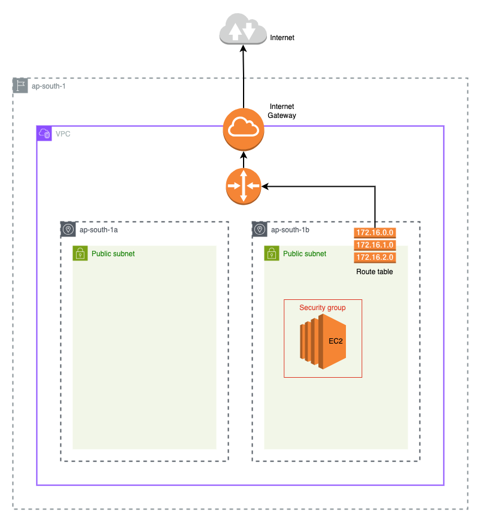
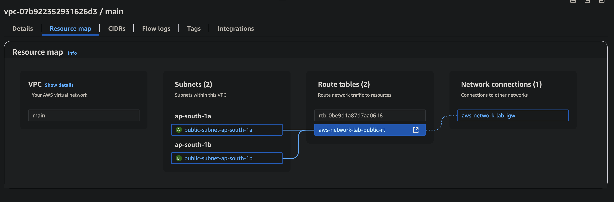

# 02-public-routing

> **📊 Lab Info**  
> **Difficulty:** 🟢 Beginner  
> **Estimated Time:** 20-25 minutes  
> **AWS Services:** VPC, Subnets, IGW, Route Tables, EC2, Security Groups  
> **Prerequisites:** Completed Lab 01-vpc-subnet, AWS CLI configured

## Overview

This lab builds on the previous VPC and subnet setup by making the subnets **publicly accessible**. It verifies internet access by launching a basic web server in one of the subnets.

## Architecture



## You’ll Learn

- How to create an **Internet Gateway** and attach it to your VPC
- How to configure **route tables** with default routes (`0.0.0.0/0`) for internet access
- How to associate route tables with subnets to make them truly "public"
- How to use **security groups** with separate ingress/egress rules (modern Terraform approach)
- How to launch EC2 instances with **user data scripts** for automated software installation
- How to use **data sources** to fetch the latest Ubuntu AMI dynamically
- How to verify internet connectivity and test your public infrastructure
- The difference between having a public IP and actually being internet-accessible

## Resources You'll Create

- 1 VPC with DNS settings enabled
- N Subnets distributed across Availability Zones
- 1 Internet Gateway attached to the VPC
- 1 Route Table with a route to `0.0.0.0/0` via the IGW
- N Route Table Associations to link each subnet to the public route
- 1 EC2 instance with NGINX or Apache pre-installed using user data
- 1 Security Group allowing inbound HTTP (80)

## Key Concepts Explained

### What makes a subnet "public"?

- Subnet has a route to an Internet Gateway (0.0.0.0/0 → IGW)
- Instance has a public IP address
- Security groups allow the desired traffic

### Route Table Association

- Without association, subnets use the VPC's default route table
- Explicit association gives you control over routing behavior

### Security Group Best Practices

- This lab uses separate ingress/egress rules (recommended approach)
- Default egress allows all outbound traffic
- Ingress rules are restrictive by default

## Example Usage

Create a `terraform.tfvars` file:

```hcl
vpc_cidr = "10.0.0.0/16"
vpc_name = "my-lab-vpc"
num_subnets = 3
tags = {
  Environment = "lab"
  Project     = "aws-networking"
}
```

## Deployment

```bash
cd 02-public-routing
terraform init
terraform plan
terraform apply
```

## What Gets Created

After running `terraform apply`, you'll see outputs similar to:

```text
Outputs:

instance_public_ip = "15.206.68.69"
vpc_id = "vpc-07b922352931626d3"
```

Here's how the resource map looks in the console:



Notice how this time the public subnets each are connected to the public route table going to the internet gateway along with the default route table.

## How to Test

After `terraform apply` completes:

1. **Get the public IP:**

    ```bash
    terraform output instance_public_ip
    ```

2. **Test HTTP connectivity**:

    ```bash
    curl http://<public-ip>
    ```

3. **Expected result**: You should see the default NGINX welcome page HTML

4. **Browser test**: Open http://<public-ip> in your browser

5. **Troubleshooting connectivity**:

    ```bash
    # Check if instance is running
    aws ec2 describe-instances --instance-ids <instance-id>

    # Verify security group rules
    aws ec2 describe-security-groups --group-ids <sg-id>
    ```

## Cleanup

```bash
terraform destroy
```

## Next Steps

- **03-private-subnets**: Create private subnets with NAT Gateway for secure outbound access
- **04-hybrid-vpc**: Build complete VPC with both public and private subnets plus routing