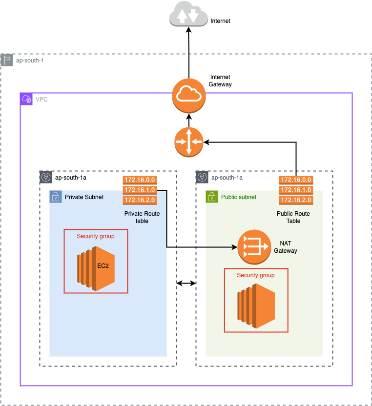

# 03-private-routing

Private subnets with NAT Gateway for secure outbound internet access

> **📊 Lab Info**
> **Difficulty: 🟡 Intermediate**
> **Estimated Time: 25-30 minutes**
> **AWS Services: VPC, Private Subnets, NAT Gateway, Elastic IP, Route Tables**
> **Prerequisites: Understanding of Labs 1-2, VPC routing concepts**

## Overview

This lab sets up private subnets across multiple Availability Zones with a NAT Gateway, allowing instances in private subnets to access the internet for outbound tasks like installing packages, fetching updates, or calling external APIs—all without being exposed to incoming internet traffic.

## Architecture



## You'll Learn

- How to create private subnets that aren't directly accessible from the internet
- How to set up a NAT Gateway with an Elastic IP for outbound internet access
- How to configure route tables to direct private subnet traffic through NAT
- The difference between public and private subnet routing patterns
- How to design a hybrid VPC with both public and private networking tiers
- Best practices for subnet CIDR allocation to avoid overlapping ranges

## Resources Created

- 1 VPC with DNS support enabled
- 1 Internet Gateway (required for NAT Gateway functionality)
- N Private Subnets distributed across multiple AZs
- 1 Public Subnet (hosts the NAT Gateway)
- 1 Elastic IP (static public IP for NAT Gateway)
- 1 NAT Gateway (managed service for outbound internet access)
- 2 Route Tables (public and private routing)
- Route Table Associations linking subnets to appropriate route tables

## Key Concepts Explained

### Private vs Public Subnets

- Public subnet: Has route to Internet Gateway (0.0.0.0/0 → IGW)
- Private subnet: Has route to NAT Gateway (0.0.0.0/0 → NAT)
- Private subnets cannot receive inbound internet traffic

## NAT Gateway Benefits

- Enables outbound internet access from private subnets
- AWS-managed service (highly available within single AZ)
- Automatically scales bandwidth up to 45 Gbps
- Requires Elastic IP for consistent public IP address

## Subnet CIDR Strategy

- Private subnets: 10.0.0.0/24, 10.0.1.0/24, 10.0.2.0/24
- Public subnet: 10.0.3.0/24 (after private subnets to avoid overlap)
- Uses cidrsubnet() function for automatic, non-overlapping allocation

## Route Table Architecture

- Public route table: Routes internet traffic via IGW
- Private route table: Routes internet traffic via NAT Gateway
- Multiple private subnets can share one route table

## Example Configuration

Create a terraform.tfvars file:

```bash
vpc_cidr = "10.0.0.0/16"
vpc_name = "private-lab-vpc"
num_subnets = 3

tags = {
  Environment = "lab"
  project     = "private-networking"  # Required for resource naming
  Lab         = "03-private-routing"
}
region = "ap-south-1"
```

## How to Use

```bash
terraform init
terraform plan
terraform apply
Expected Outputs
```

## After successful deployment

```text
Outputs:

bastion_public_dns = "ec2-65-0-184-233.ap-south-1.compute.amazonaws.com"
bastion_public_ip = "65.0.184.233"
elastic_ip = "13.204.98.82"
internet_gateway_id = "igw-0dae0a9c05021afd3"
nat_gateway_id = "nat-04d7d284f368c737b"
private_instance_ip = "10.0.0.249"
private_subnet_ids = [
  "subnet-0e645e5b87015b60d",
  "subnet-0f059c3b4f2c0ef9b",
]
public_subnet_id = "subnet-09d12a09e31f3ab3e"
vpc_id = "vpc-0234efdebedc7663c"
```

## Testing NAT Gateway Connectivity

## Testing

1. **Connect using SSH agent forwarding:**

   ```bash
   ssh-add ~/.ssh/your-private-key
   ssh -A -i ~/.ssh/your-private-key ec2-user@<bastion-ip>
   ssh ec2-user@<private-instance-ip>
   ```

2. **Test NAT Gateway:**

  ```bash
  cat status.txt  # Should show "NAT Gateway working!"
  curl http://checkip.amazonaws.com  # Shows NAT Gateway public IP
  ```

## Troubleshooting

### Private instances can't reach internet

- Verify NAT Gateway is in "available" state
- Check private route table has 0.0.0.0/0 → NAT Gateway route
- Ensure Elastic IP is properly associated with NAT Gateway

### NAT Gateway creation fails

- Public subnet must have route to Internet Gateway
- Elastic IP must be allocated to VPC (not EC2-Classic)
- Check if you have NAT Gateway limits in your region

### High costs

- NAT Gateways have hourly charges (~$45/month) plus data processing fees
- Consider NAT Instance for cost-sensitive labs (not covered here)

## Cost Considerations

⚠️ Important: NAT Gateways incur charges (~$1.50/day). Remember to run terraform destroy when finished.
What's Next?

## To destroy resources

```bash
terraform destroy
```
