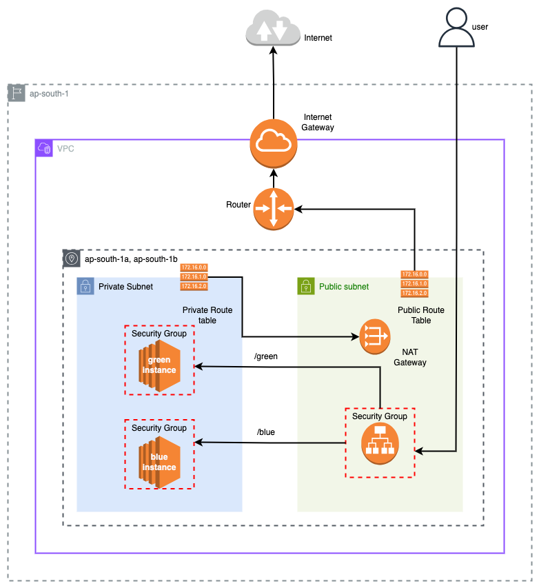

# 04-application-load-balancing

> **📊 Lab Info**
> **Difficulty: 🟡 Intermediate**
> **Estimated Time: 30-35 minutes**
> **AWS Services: VPC, ALB, Target Groups, EC2, Security Groups, Route Tables**
> **Prerequisites: Understanding of Labs 1-3, HTTP routing concepts, load balancing fundamentals**

## Overview

This lab creates a complete **Application Load Balancer (ALB)** setup with path-based routing to demonstrate modern web application architecture. The ALB distributes incoming HTTP traffic between two different application versions (Blue and Green) based on URL paths, showcasing how to run multiple app versions simultaneously with intelligent traffic routing.

## Architecture



- Public Subnets: Application Load Balancer (internet-facing)
- Private Subnet: Blue and Green EC2 instances (isolated from direct internet access)
- Path-based routing: /blue* → Blue App, /green* → Green App
- Target Groups: Health monitoring and traffic distribution
- Security Groups: Layered security between ALB and EC2 instances

## You'll Learn

- How to create and configure an Application Load Balancer for high availability
- How to implement path-based routing for multiple application versions
- How to set up Target Groups with health checks for automatic failover
- How to configure security groups for multi-tier application architecture
- The difference between ALB listeners, rules, and target groups
- Best practices for blue-green deployment patterns using ALB
- How to serve different applications from the same load balancer endpoint

## Resources Created

- 1 VPC with public and private subnets (via module)
- 1 Internet-facing Application Load Balancer
- 2 Target Groups (Blue and Green apps)
- 2 EC2 instances running NGINX (Blue and Green servers)
- 2 Security Groups (ALB and EC2 instances)
- 1 ALB Listener with HTTP traffic on port 80
- 2 Listener Rules for path-based routing
- Target Group Attachments linking instances to target groups

## Key Concepts Explained

### Application Load Balancer (ALB)

- Layer 7 (HTTP/HTTPS) load balancer with advanced routing capabilities
- Supports path-based, host-based, and header-based routing
- Built-in health checks and automatic failover
- Integrates with AWS services like Auto Scaling and ECS

### Target Groups

- Logical grouping of targets (EC2 instances, IP addresses, Lambda functions)
- Performs health checks on registered targets
- Routes traffic only to healthy targets
- Supports multiple health check configurations per group

### Path-Based Routing

- Routes requests based on URL path patterns
- /green* requests → Green Target Group → Green EC2 instance
- /blue* requests → Blue Target Group → Blue EC2 instance
- Enables serving multiple applications from single load balancer

### Security Group Architecture

- ALB Security Group: Allows HTTP (port 80) from internet (0.0.0.0/0)
- EC2 Security Group: Allows HTTP only from ALB Security Group
- Layered security: EC2 instances not directly accessible from internet

### Health Check Configuration

- Path: /green and /blue for respective target groups
- Matcher: HTTP status codes 200-399 considered healthy
- Interval: 30 seconds between health checks
- Timeout: 5 seconds to wait for response
- Healthy Threshold: 2 consecutive successful checks = healthy
- Unhealthy Threshold: 2 consecutive failed checks = unhealthy

## Example Configuration

Create a terraform.tfvars file:

```bash
vpc_cidr = "10.0.0.0/16"
vpc_name = "alb-lab-vpc"
num_public_subnets = 2
num_private_subnets = 2

tags = {
  Environment = "lab"
  project     = "alb-routing"  # Required for resource naming
  Lab         = "04-application-load-balancing"
}
region = "ap-south-1"
```

## How to Use

```bash
terraform init
terraform plan
terraform apply
```

## Expected Outputs

After successful deployment:

```text
Outputs:

alb_dns_name = "alb-routing-alb-1234567890.ap-south-1.elb.amazonaws.com"
alb_zone_id = "ZP97RAFLXTNZK"
blue_instance_id = "i-0123456789abcdef0"
blue_instance_private_ip = "10.0.1.100"
green_instance_id = "i-0987654321fedcba0"
green_instance_private_ip = "10.0.0.150"
blue_target_group_arn = "arn:aws:elasticloadbalancing:ap-south-1:123456789012:targetgroup/blue-tg/1234567890123456"
green_target_group_arn = "arn:aws:elasticloadbalancing:ap-south-1:123456789012:targetgroup/green-tg/6543210987654321"
vpc_id = "vpc-0abcdef1234567890"
```

## Testing Load Balancer Routing

### Test Path-Based Routing

- Test Blue App:

  ```bash
  curl http://<alb-dns-name>/blue
  # Expected: <h1>Welcome to the Blue App</h1>
  ```

- Test Green App:

  ```bash
  curl http://<alb-dns-name>/green
  # Expected: <h1>Welcome to the Green App</h1>
  ```

- Test Default Behavior:

  ```bash
  curl http://<alb-dns-name>/
  # Expected: 400 Bad Request (no matching rule)
  ```

## Monitor Health Checks

### Check Target Group Health

- Navigate to EC2 → Target Groups in AWS Console
- Select blue-tg or green-tg
- View "Targets" tab to see health status

### Test Health Check Endpoints

```bash
# These should return the app content if healthy
curl http://<alb-dns-name>/blue
curl http://<alb-dns-name>/green
```

## Troubleshooting

### ALB returns 503 Service Unavailable

- Check target group health in AWS Console
- Verify EC2 instances are running and NGINX is active
- Ensure security groups allow traffic from ALB to EC2 instances
- Check VPC route tables for proper subnet routing

### Health checks failing

- Verify NGINX is serving content at /blue and /green paths
- Check EC2 instance logs: sudo journalctl -u nginx
- Ensure target group health check paths match NGINX configuration
- Verify security group allows port 80 from ALB security group

### Path routing not working

- Check listener rules are configured with correct path patterns
- Verify rule priorities (lower numbers = higher priority)
- Ensure target groups are properly attached to listener rules
- Test individual target health using direct EC2 access via bastion

### EC2 instances can't install packages

- Verify NAT Gateway is properly configured (from Lab 03)
- Check route tables: private subnets should route 0.0.0.0/0 → NAT Gateway
- Ensure EC2 instances have outbound internet access for package downloads

## Cost Considerations

⚠️ Important: ALB incurs hourly charges. NAT Gateway adds additional costs. Remember to run `terraform destroy` when finished.

## To destroy resources

```bash
terraform destroy
```
