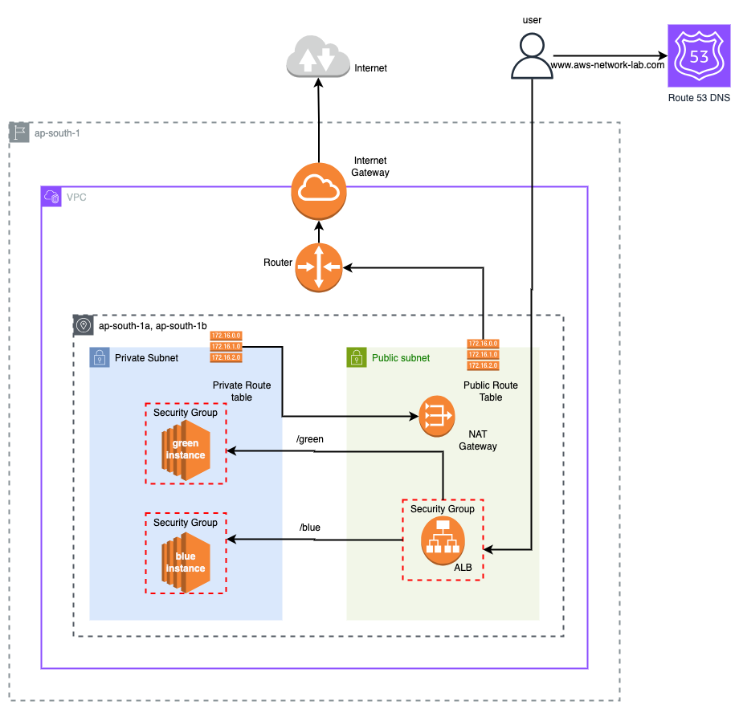

# 05-route53-dns-integration

> **📊 Lab Info**
> **Difficulty: 🟡 Intermediate**
> **Estimated Time: 25-30 minutes**
> **AWS Services: Route53, ALB, VPC, EC2, Security Groups**
> **Prerequisites: Understanding of Labs 1-4, DNS concepts, domain registration**

## Overview

This lab extends the Application Load Balancer setup from Lab 4 by integrating Route53 DNS to provide custom domain access to your applications. Instead of using the ALB's auto-generated DNS name, users can access your blue and green applications through a memorable custom domain. The lab demonstrates how to create DNS `alias records` that point to AWS load balancers for production-ready web applications.

## Architecture



- Route53 Hosted Zone: Manages DNS records for your custom domain
- Alias A Records: Points root domain and www subdomain to ALB
- Application Load Balancer: Distributes traffic based on URL paths
- Path-Based Routing: /blue and /green paths route to respective applications
- DNS Resolution Flow: `Custom Domain → Route53 → ALB → Target Groups → EC2 Instances`

## You'll Learn

- How to integrate Route53 with Application Load Balancers
- The difference between Alias A records and CNAME records
- Why Alias records are preferred for AWS resources
- How to set up apex domain (root domain) DNS routing
- How to conditionally create DNS records using Terraform
- Best practices for production DNS configuration
- How to test DNS resolution and propagation

## Resources Created

- 1 VPC with public and private subnets (via module)
- 1 Internet-facing Application Load Balancer
- 2 Target Groups (Blue and Green apps)
- 2 EC2 instances running NGINX (Blue and Green servers)
- 2 Security Groups (ALB and EC2 instances)
- 2 Route53 Alias A Records (root domain and www subdomain)
- Route53 hosted zone lookup (existing)

## Key Concepts Explained

### DNS Record Types

- A Record: Maps domain name to IPv4 address
- Alias A Record: Maps domain name to AWS resource (ALB, CloudFront, etc.)
- CNAME Record: Maps subdomain to another domain name (cannot be used for apex domain)

### Route53 Alias A Records

- Alias vs CNAME: Alias records can be used for apex domains (root domain)
- AWS Integration: Directly integrates with ALB, no additional DNS lookup required
- Health Checks: Can evaluate target health (ALB) automatically
- No Additional Charges: Unlike CNAME records, Alias records don't incur Route53 query charges

### Apex Domain vs Subdomain

- Apex Domain: Root domain (`aws-network-lab.com`)
- Subdomain: Prefixed domain (`www.aws-network-lab.com`)
- Why Alias for Apex: CNAME records are not allowed at the zone apex (DNS RFC limitation)

## Conditional Resource Creation

- Terraform Count: Use `count = condition ? 1 : 0` for optional resources
- Flexible Configuration: Allow users to choose whether to create www subdomain
- Resource References: Access conditional resources using array notation [0]

## Example Configuration

Create a terraform.tfvars file:

```bash
vpc_cidr = "10.0.0.0/16"
vpc_name = "route53-lab-vpc"
num_public_subnets = 2
num_private_subnets = 2

# Domain Configuration
domain_name = "your-domain.com"  # Replace with your actual domain
create_www_record = true          # Set to false to skip www subdomain

# Application Paths
blue_app_path = "/blue"
green_app_path = "/green"

# Health Check Configuration
health_check_interval = 30
health_check_timeout = 5
healthy_threshold = 2
unhealthy_threshold = 2

tags = {
  Environment = "lab"
  project     = "route53-dns"  # Required for resource naming
  Lab         = "05-route53-dns-integration"
}

region = "ap-south-1"
key_name = "your-key-pair"  # Your existing EC2 key pair
```

## Prerequisites

⚠️ Important: This lab requires a domain registered in Route53 or a domain with Route53 as the DNS service.

### Option 1: Register Domain in Route53

- Go to Route53 → Registered Domains
- Register a new domain (costs $12-15/year for .com)
- Route53 automatically creates a hosted zone

### Option 2: Use Existing Domain

- Update domain's nameservers to point to Route53
- Create hosted zone in Route53 for your domain
- Update `domain_name` variable in terraform.tfvars

## How to Use

```bash
terraform init
terraform plan
terraform apply
```

## Expected Outputs

After successful deployment:

```bash

Outputs:

# ALB Information
alb_dns_name = "route53-dns-alb-1234567890.ap-south-1.elb.amazonaws.com"
alb_zone_id = "ZP97RAFLXTNZK"

# DNS Information
domain_name = "aws-network-lab.com"
hosted_zone_id = "Z1D633PJN98FT9"
root_domain_record = "aws-network-lab.com"
www_domain_record = "www.aws-network-lab.com"

# Application URLs - ALB Direct
blue_app_url_alb = "http://route53-dns-alb-1234567890.ap-south-1.elb.amazonaws.com/blue"
green_app_url_alb = "http://route53-dns-alb-1234567890.ap-south-1.elb.amazonaws.com/green"

# Application URLs - Custom Domain
blue_app_url_domain = "http://aws-network-lab.com/blue"
green_app_url_domain = "http://aws-network-lab.com/green"
www_blue_app_url = "http://www.aws-network-lab.com/blue"
www_green_app_url = "http://www.aws-network-lab.com/green"

# Testing Commands
test_commands = {
  blue_app_alb = "curl http://route53-dns-alb-1234567890.ap-south-1.elb.amazonaws.com/blue"
  blue_app_domain = "curl http://aws-network-lab.com/blue"
  dns_lookup_root = "nslookup aws-network-lab.com"
  dns_lookup_www = "nslookup www.aws-network-lab.com"
  green_app_alb = "curl http://route53-dns-alb-1234567890.ap-south-1.elb.amazonaws.com/green"
  green_app_domain = "curl http://aws-network-lab.com/green"
  invalid_alb = "curl http://route53-dns-alb-1234567890.ap-south-1.elb.amazonaws.com/ # Should return 400"
  www_blue_app = "curl http://www.aws-network-lab.com/blue"
  www_green_app = "curl http://www.aws-network-lab.com/green"
}
```

## Testing DNS Integration

### Test Direct ALB Access (Should work immediately)

```bash
# Test ALB directly using auto-generated DNS name
curl http://<alb-dns-name>/blue
curl http://<alb-dns-name>/green
```

### Test Custom Domain Access (May take 5-10 minutes for DNS propagation)

```bash
# Test using your custom domain
curl http://your-domain.com/blue
curl http://your-domain.com/green

# Test www subdomain (if created)
curl http://www.your-domain.com/blue
curl http://www.your-domain.com/green
```

### Test DNS Resolution

```bash
# Check if domain resolves to ALB
nslookup your-domain.com
nslookup www.your-domain.com

# More detailed DNS information
dig your-domain.com
dig www.your-domain.com
Browser Testing
```

### Open browser and navigate to

```bash
http://your-domain.com/blue (should show "Welcome to the Blue App")
http://your-domain.com/green (should show "Welcome to the Green App")
http://www.your-domain.com/blue (if www record created)
```

## Advanced Configuration

### Skip www Subdomain Creation

```bash
# In terraform.tfvars
create_www_record = false
```

### Custom Health Check Configuration

```bash
# In terraform.tfvars
health_check_interval = 15      # Check every 15 seconds
health_check_timeout = 3        # 3 second timeout
healthy_threshold = 3           # 3 successful checks = healthy
unhealthy_threshold = 3         # 3 failed checks = unhealthy
```

## Troubleshooting

### DNS Not Resolving

- Wait for Propagation: DNS changes can take 5-48 hours globally
- Check Nameservers: Verify domain uses Route53 nameservers
- Verify Hosted Zone: Ensure hosted zone exists for your domain
- Test Local DNS: Try nslookup or dig commands

### ALB Working but Domain Failing

- Check Alias Records: Verify A records point to correct ALB
- Zone ID Mismatch: Ensure ALB zone ID matches in alias record
- Hosted Zone: Confirm hosted zone matches your domain exactly

### Terraform Errors

```bash
# If Route53 hosted zone not found
Error: No matching Route53 Hosted Zone found
```

Solution: Verify domain_name variable matches your hosted zone exactly

### Health Checks Failing

- Follow troubleshooting steps from Lab 4
- Verify EC2 instances are serving content at `/blue` and `/green` paths
- Check security groups allow `ALB → EC2` communication

## DNS Propagation Monitoring

### Check DNS Propagation Globally

Use online tools:

- whatsmydns.net
- dnschecker.org
- Enter your domain to see propagation status worldwide

## DNS TTL Values

- Route53 alias records have a default TTL of 60 seconds
- Lower TTL = faster propagation but more DNS queries
- Higher TTL = slower propagation but fewer DNS queries

## Cost Considerations

⚠️ Important Costs:

- Domain Registration: $12-15/year for .com domains
- Route53 Hosted Zone: $0.50/month per hosted zone
- Route53 Queries: $0.40 per million queries (Alias queries are free)
- ALB: $0.0225/hour + $0.008 per LCU-hour
- NAT Gateway: $0.045/hour + data processing charges

Remember to run terraform destroy when finished to avoid ongoing charges.

## To Destroy Resources

```bash
terraform destroy
```

Note: This will not delete your domain registration or hosted zone (which is correct - you typically want to keep these).
